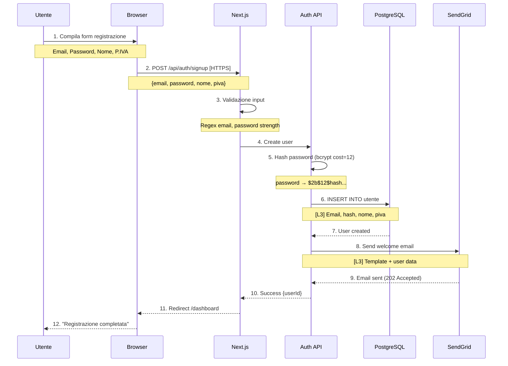
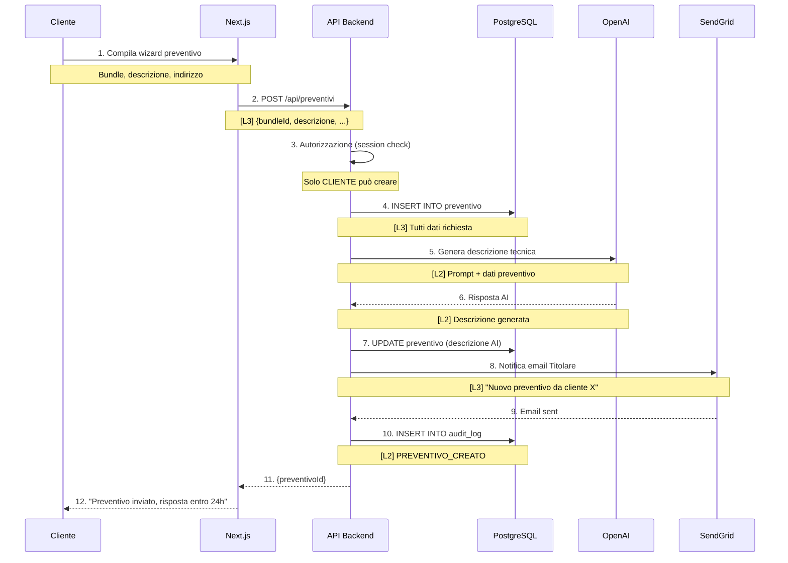
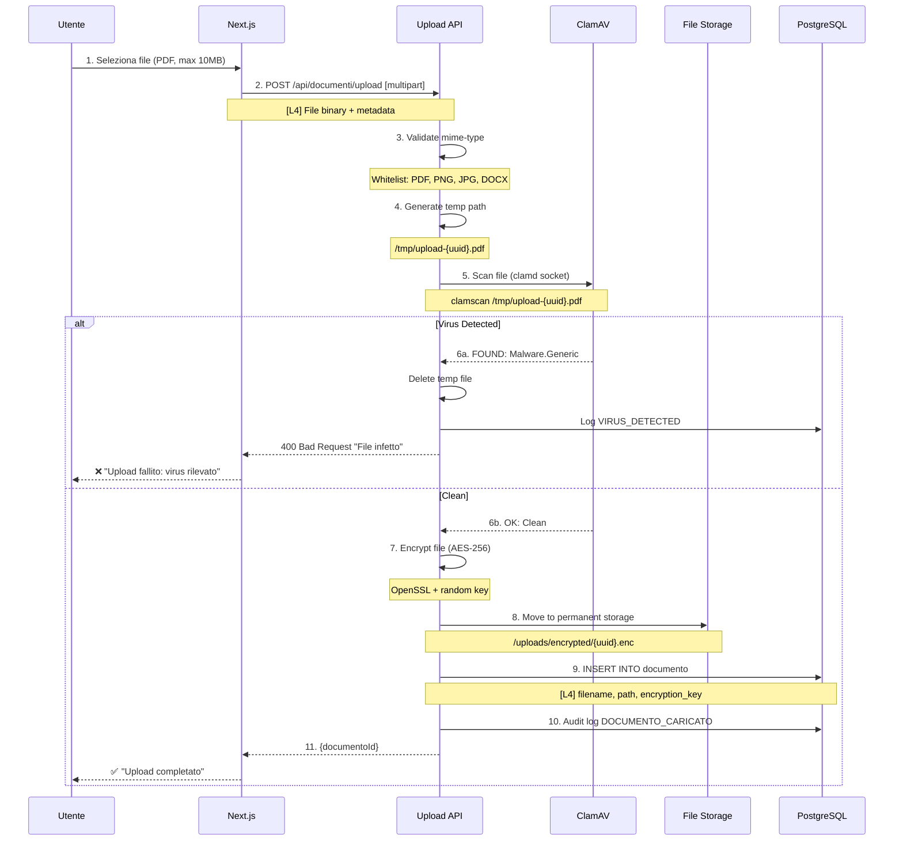
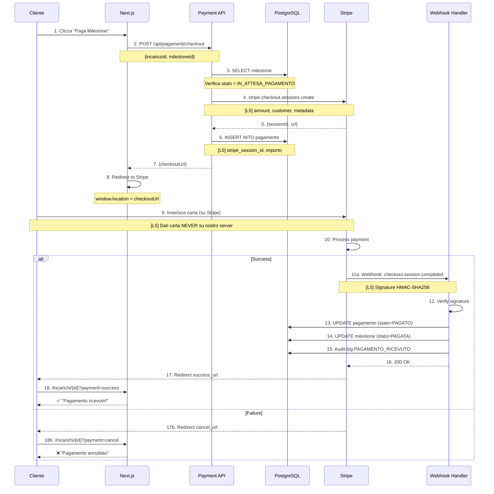
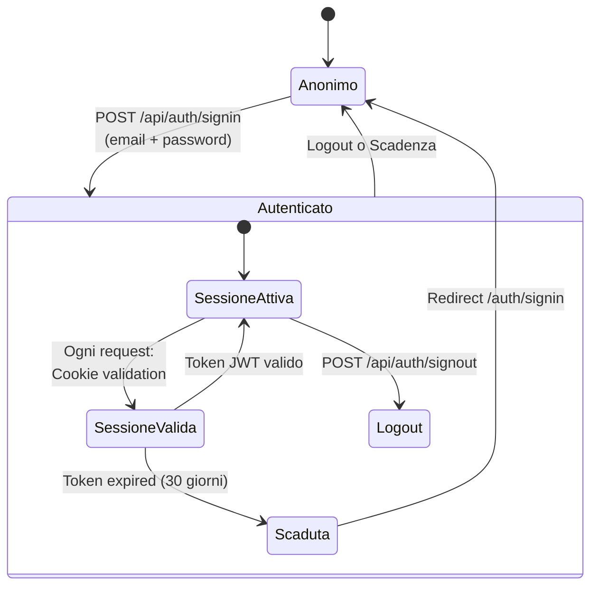

# 🔄 Data Flow Diagram (DFD)
## Studio Ing. Romano - Mappatura Flussi Dati

**Versione**: 1.0
**Data**: 2025-12-27
**Riferimento**: ISO/IEC 27001:2022 - Controllo A.8.11, GDPR Art. 30
**Responsabile**: Ing. Romano Domenico (Titolare)
**Stato**: PRODUCTION

---

## 📋 Indice

1. [Scopo e Ambito](#1-scopo-e-ambito)
2. [Legenda e Notazione](#2-legenda-e-notazione)
3. [DFD Livello 0 - Context Diagram](#3-dfd-livello-0---context-diagram)
4. [DFD Livello 1 - Sistema Completo](#4-dfd-livello-1---sistema-completo)
5. [DFD Livello 2 - Dettaglio Processi](#5-dfd-livello-2---dettaglio-processi)
6. [Classificazione Dati](#6-classificazione-dati)
7. [Analisi Sicurezza Flussi](#7-analisi-sicurezza-flussi)
8. [Registro Trattamenti GDPR](#8-registro-trattamenti-gdpr)
9. [Controlli di Sicurezza](#9-controlli-di-sicurezza)

---

## 1. Scopo e Ambito

### 1.1 Obiettivo

Mappare tutti i flussi di dati del sistema Studio ERP per:
- **Identificare** dove risiedono dati sensibili
- **Tracciare** movimenti dati tra componenti
- **Valutare** rischi di sicurezza per ogni flusso
- **Documentare** trattamenti GDPR (Art. 30)
- **Supportare** analisi impatto privacy (DPIA)

### 1.2 Ambito

**In Scope**:
- Piattaforma Studio ERP (applicazione web Next.js)
- Database PostgreSQL
- Servizi terzi integrati (Stripe, SendGrid, OpenAI)
- Interfacce utente (web browser)
- Backup e storage

**Out of Scope**:
- Email client personali utenti
- Dispositivi personali (smartphone, laptop) non gestiti
- Reti domestiche utenti

---

## 2. Legenda e Notazione

### 2.1 Simboli DFD

```
┌─────────┐
│ ENTITÀ  │  = Entità Esterna (utente, sistema terzo)
│ ESTERNA │
└─────────┘

┌──────────┐
│ PROCESSO │  = Processo/Elaborazione dati
└──────────┘

║ DATA    ║
║ STORE   ║  = Archivio dati (database, file)
╚═════════╝

────────▶    = Flusso dati (direzione freccia)
```

### 2.2 Classificazione Dati

| Livello | Etichetta | Descrizione | Esempio |
|---------|-----------|-------------|---------|
| **L1** | `[PUBBLICO]` | Dati pubblici, nessun rischio | Nome bundle, prezzi listino |
| **L2** | `[INTERNO]` | Dati interni azienda, basso rischio | Note tecniche, task interni |
| **L3** | `[RISERVATO]` | Dati clienti, medio rischio | Email, P.IVA, indirizzi |
| **L4** | `[SENSIBILE]` | Dati personali GDPR, alto rischio | Documenti identità, contratti firmati |
| **L5** | `[CRITICO]` | Dati finanziari/sanitari, rischio massimo | Dati sanitari (non trattati), dati pagamento |

---

## 3. DFD Livello 0 - Context Diagram

### 3.1 Overview Sistema

```mermaid
graph TB
    %% Entità Esterne
    Cliente[👤 Cliente<br/>Privato/Azienda]
    Titolare[👤 Titolare<br/>Ing. Romano]
    Collaboratore[👤 Collaboratore<br/>Tecnico]
    Stripe[💳 Stripe<br/>Payment Gateway]
    SendGrid[📧 SendGrid<br/>Email Service]
    OpenAI[🤖 OpenAI<br/>AI Assistant]
    Garante[🏛️ Garante Privacy<br/>Autorità]

    %% Sistema Centrale
    StudioERP[(Studio ERP<br/>Platform)]

    %% Flussi Dati
    Cliente -->|1. Registrazione [L3]| StudioERP
    Cliente -->|2. Richiesta Preventivo [L3]| StudioERP
    Cliente -->|3. Upload Documento [L4]| StudioERP
    Cliente -->|4. Pagamento Milestone [L5]| StudioERP

    StudioERP -->|5. Email Conferma [L3]| Cliente
    StudioERP -->|6. Fattura Elettronica [L4]| Cliente

    Titolare -->|7. Gestione Incarichi [L3]| StudioERP
    Titolare -->|8. Approvazione Preventivi [L3]| StudioERP

    Collaboratore -->|9. Aggiornamento Task [L2]| StudioERP
    Collaboratore -->|10. Visualizza Documenti [L4]| StudioERP

    StudioERP -->|11. Checkout Session [L5]| Stripe
    Stripe -->|12. Webhook Pagamento [L5]| StudioERP

    StudioERP -->|13. Invio Email [L3]| SendGrid

    StudioERP -->|14. Query Assistente [L2]| OpenAI
    OpenAI -->|15. Risposta AI [L2]| StudioERP

    StudioERP -.->|16. Data Breach Notifica [L4]| Garante

    style StudioERP fill:#4A90E2,stroke:#333,stroke-width:4px,color:#fff
    style Cliente fill:#7ED321,stroke:#333,stroke-width:2px
    style Titolare fill:#F5A623,stroke:#333,stroke-width:2px
    style Stripe fill:#BD10E0,stroke:#333,stroke-width:2px
    style Garante fill:#D0021B,stroke:#333,stroke-width:2px
```

### 3.2 Descrizione Flussi Principali

| ID | Flusso | Dati | Classificazione | Protezione |
|----|--------|------|-----------------|------------|
| 1 | Cliente → ERP: Registrazione | Email, Password, Nome | L3 RISERVATO | HTTPS, bcrypt |
| 2 | Cliente → ERP: Preventivo | P.IVA, Indirizzo, Telefono | L3 RISERVATO | HTTPS, encryption DB |
| 3 | Cliente → ERP: Upload Doc | PDF planimetria, contratto | L4 SENSIBILE | HTTPS, ClamAV scan, encryption |
| 4 | Cliente → ERP → Stripe: Pagamento | Importo, Customer ID | L5 CRITICO | PCI-DSS SAQ A (delegato) |
| 11 | ERP → Stripe: Checkout | Customer ID, Amount | L5 CRITICO | HTTPS, Stripe SDK |
| 12 | Stripe → ERP: Webhook | Payment Intent, Status | L5 CRITICO | Signature verification |
| 13 | ERP → SendGrid: Email | To, Subject, Body | L3 RISERVATO | TLS, SCC GDPR |
| 16 | ERP → Garante: Breach | Data breach report | L4 SENSIBILE | HTTPS, portal autenticato |

---

## 4. DFD Livello 1 - Sistema Completo

### 4.1 Componenti Interni

```mermaid
graph TB
    %% Entità Esterne
    User[👤 Utente]
    Browser[🌐 Browser]

    %% Frontend
    NextJS[Next.js App<br/>SSR + Client]

    %% Backend
    API[API Routes<br/>Next.js Backend]
    Auth[NextAuth.js<br/>Authentication]

    %% Data Stores
    PostgreSQL[(PostgreSQL<br/>Database)]
    FileStorage[(File Storage<br/>/uploads)]
    Redis[(Redis<br/>Rate Limiting)]

    %% Servizi Esterni
    Stripe[💳 Stripe]
    SendGrid[📧 SendGrid]
    OpenAI[🤖 OpenAI]
    ClamAV[🛡️ ClamAV<br/>Antivirus]

    %% Flussi
    User -->|1. HTTP Request [L1-L4]| Browser
    Browser -->|2. HTTPS [TLS 1.3]| NextJS

    NextJS -->|3. API Call [L2-L4]| API
    NextJS -->|4. Login/Logout [L3]| Auth

    Auth -->|5. Session Check [L3]| PostgreSQL
    Auth -->|6. Password Verify [L3]| PostgreSQL

    API -->|7. CRUD Operations [L2-L4]| PostgreSQL
    API -->|8. File Upload [L4]| FileStorage
    API -->|9. Rate Limit Check [L1]| Redis

    API -->|10. Virus Scan [L4]| ClamAV
    ClamAV -->|11. Scan Result [L1]| API

    API -->|12. Send Email [L3]| SendGrid
    API -->|13. Create Checkout [L5]| Stripe
    API -->|14. AI Query [L2]| OpenAI

    Stripe -->|15. Webhook Event [L5]| API

    API -->|16. Response [L1-L4]| NextJS
    NextJS -->|17. HTML + JSON [L1-L4]| Browser
    Browser -->|18. Render UI [L1-L4]| User

    style NextJS fill:#61DAFB,stroke:#333,stroke-width:2px
    style PostgreSQL fill:#336791,stroke:#333,stroke-width:3px,color:#fff
    style Stripe fill:#635BFF,stroke:#333,stroke-width:2px
    style ClamAV fill:#E74C3C,stroke:#333,stroke-width:2px
```

### 4.2 Data Stores - Dettaglio

```mermaid
erDiagram
    POSTGRESQL ||--o{ UTENTE : contains
    POSTGRESQL ||--o{ INCARICO : contains
    POSTGRESQL ||--o{ DOCUMENTO : contains
    POSTGRESQL ||--o{ PAGAMENTO : contains
    POSTGRESQL ||--o{ AUDIT_LOG : contains
    POSTGRESQL ||--o{ SESSION : contains

    UTENTE {
        string id PK
        string email L3
        string password_hash L3
        string nome L3
        string piva L3
        enum ruolo L2
        boolean attivo L2
    }

    INCARICO {
        string id PK
        string titolo L3
        string descrizione L3
        decimal importo L4
        enum stato L2
        date data_creazione L2
    }

    DOCUMENTO {
        string id PK
        string filename L4
        string path_cifrato L4
        string mime_type L2
        boolean virus_scanned L2
        timestamp upload_date L2
    }

    PAGAMENTO {
        string id PK
        decimal importo L5
        string stripe_payment_id L5
        enum stato L3
        timestamp created_at L2
    }

    AUDIT_LOG {
        string id PK
        string tipo L2
        string utente_id L3
        jsonb metadata L3
        timestamp timestamp L2
    }

    FILE_STORAGE ||--o{ DOCUMENTO_FILE : stores

    DOCUMENTO_FILE {
        string path L4
        binary content_encrypted L4
        string encryption_key L5
    }

    REDIS ||--o{ RATE_LIMIT : caches

    RATE_LIMIT {
        string key L1
        int count L1
        timestamp expiry L1
    }
```

---

## 5. DFD Livello 2 - Dettaglio Processi

### 5.1 Processo: Registrazione Utente



**Controlli Sicurezza**:
- ✅ HTTPS TLS 1.3 (transport encryption)
- ✅ Input validation (SQL injection, XSS prevention)
- ✅ Password hashing bcrypt cost 12 (computationally expensive)
- ✅ Rate limiting: 5 registrazioni/ora per IP (anti-spam)
- ✅ Email verification token (double opt-in)
- ✅ Audit log: `UTENTE_REGISTRATO`

---

### 5.2 Processo: Creazione Incarico + Preventivo



**Controlli Sicurezza**:
- ✅ Autenticazione: Solo utenti loggati
- ✅ Autorizzazione: RBAC (solo ruolo CLIENTE)
- ✅ Input sanitization: Prisma ORM (parametrized queries)
- ✅ Rate limiting: 10 preventivi/giorno per utente
- ✅ Data minimization: Solo dati necessari inviati a OpenAI (no email, no P.IVA)
- ✅ Audit trail: Log completo azione

---

### 5.3 Processo: Upload Documento (con Antivirus)



**Controlli Sicurezza**:
- ✅ Antivirus scan (ClamAV signatures aggiornate daily)
- ✅ File type validation (mime-type whitelist)
- ✅ Size limit: 10 MB max (DoS prevention)
- ✅ Encryption at rest: AES-256-CBC
- ✅ Unique filename: UUID (no path traversal)
- ✅ Access control: Solo owner e collaboratori assegnati
- ✅ Audit trail: Chi/quando ha caricato

---

### 5.4 Processo: Pagamento Milestone (Stripe)



**Controlli Sicurezza (PCI-DSS Compliance)**:
- ✅ **NO carta mai su nostro server** (PCI-DSS SAQ A)
- ✅ Stripe Checkout hosted (PCI Level 1 certified)
- ✅ Webhook signature verification (HMAC-SHA256)
- ✅ Idempotency: Check pagamento duplicato
- ✅ HTTPS only (TLS 1.2+)
- ✅ Stripe Radar: Fraud detection automatico
- ✅ Amount validation: Server-side (no client tampering)
- ✅ Audit trail: Log completo transazione

---

## 6. Classificazione Dati

### 6.1 Tabella Dati per Livello

| Livello | Dato | Tabella | Campo | Protezione |
|---------|------|---------|-------|------------|
| **L1 PUBBLICO** | Nome bundle | `bundle` | `nome` | Nessuna |
| **L1** | Prezzi listino | `bundle` | `prezzo_min/max` | Nessuna |
| **L2 INTERNO** | Note tecniche | `incarico` | `note_interne` | ACL (solo staff) |
| **L2** | Task progress | `milestone` | `percentuale` | ACL |
| **L3 RISERVATO** | Email utente | `utente` | `email` | Encryption DB, ACL |
| **L3** | P.IVA cliente | `utente` | `partita_iva` | Encryption DB |
| **L3** | Indirizzo sede | `utente` | `indirizzo` | Encryption DB |
| **L3** | Password hash | `utente` | `password` | bcrypt cost 12 |
| **L4 SENSIBILE** | Documento PDF | `documento` | `path` | AES-256 encryption, antivirus |
| **L4** | Contratto firmato | `documento` | `path` | AES-256 + digital signature |
| **L4** | Preventivo dettagliato | `preventivo` | `descrizione_tecnica` | Encryption DB, ACL |
| **L5 CRITICO** | Stripe Payment ID | `pagamento` | `stripe_payment_intent_id` | Encryption DB, audit log |
| **L5** | Encryption key | (filesystem) | `.key` | Separato da file, ACL root-only |

### 6.2 Data Retention Policy

| Tipo Dato | Conservazione | Rationale | Cancellazione |
|-----------|---------------|-----------|---------------|
| **Account utente** | Finché attivo | GDPR legittimo interesse | Su richiesta (diritto cancellazione) |
| **Incarichi completati** | 10 anni | Obbligo fiscale (conservazione fatture) | Automatica dopo 10 anni |
| **Documenti tecnici** | 10 anni | Responsabilità professionale ingegnere | Automatica dopo 10 anni |
| **Log audit** | 5 anni | ISO 27001 compliance | Automatica dopo 5 anni |
| **Log applicazione** | 90 giorni | Troubleshooting | Rotazione automatica |
| **Backup** | 30 giorni (daily), 12 mesi (monthly) | Disaster recovery | Policy automatica |
| **Session tokens** | 30 giorni (inattività) | Security best practice | Automatica |
| **Dati pagamento (Stripe)** | Gestito da Stripe | PCI-DSS delegato | Su richiesta via Stripe API |

---

## 7. Analisi Sicurezza Flussi

### 7.1 Threat Modeling (STRIDE)

| Flusso | Minaccia | Tipo STRIDE | Rischio | Controllo Implementato |
|--------|----------|-------------|---------|------------------------|
| Login | Credential stuffing | **S**poofing | Alto | Rate limit, MFA (futuro), bcrypt |
| API Request | SQL Injection | **T**ampering | Alto | Prisma ORM parametrized queries |
| File Upload | Malware | **T**ampering | Critico | ClamAV antivirus scan |
| Webhook Stripe | Replay attack | **R**epudiation | Medio | Signature verification, idempotency |
| Database | Data breach | Information **D**isclosure | Critico | Encryption at rest, ACL, firewall |
| Email SendGrid | Man-in-the-middle | Information **D**isclosure | Medio | TLS 1.2+ enforced |
| Session | Hijacking | **E**levation of Privilege | Alto | HTTPS-only cookie, SameSite=Strict |
| Service | DDoS | **D**enial of Service | Medio | Rate limiting, Hetzner DDoS protection |

### 7.2 Security Boundaries

```
┌─────────────────────────────────────────────────────┐
│              TRUST BOUNDARY: Internet               │
│                                                     │
│  ┌────────────────────────────────────────────┐   │
│  │   TRUST BOUNDARY: HTTPS (TLS 1.3)          │   │
│  │                                            │   │
│  │  ┌───────────────────────────────────┐    │   │
│  │  │ TRUST BOUNDARY: Authentication    │    │   │
│  │  │                                   │    │   │
│  │  │  ┌─────────────────────────┐     │    │   │
│  │  │  │ TRUST BOUNDARY: RBAC    │     │    │   │
│  │  │  │                         │     │    │   │
│  │  │  │  • PostgreSQL          │     │    │   │
│  │  │  │  • File Storage        │     │    │   │
│  │  │  │  • Sensitive API       │     │    │   │
│  │  │  └─────────────────────────┘     │    │   │
│  │  └───────────────────────────────────┘    │   │
│  └────────────────────────────────────────────┘   │
└─────────────────────────────────────────────────────┘
```

**Attraversamento Boundaries**:
1. **Internet → HTTPS**: TLS certificate verification, HSTS header
2. **HTTPS → Auth**: Session cookie validation (NextAuth.js)
3. **Auth → RBAC**: Role check (CLIENTE, COLLABORATORE, TITOLARE)
4. **RBAC → Data**: Row-level security (Prisma where clause)

---

## 8. Registro Trattamenti GDPR (Art. 30)

### 8.1 Trattamento 1: Gestione Clienti

**Finalità**: Erogazione servizi professionali ingegneria
**Base Giuridica**: Esecuzione contratto (Art. 6.1.b GDPR)
**Categorie Interessati**: Clienti (persone fisiche e giuridiche)
**Categorie Dati**:
- Anagrafici: nome, cognome, email, telefono
- Fiscali: P.IVA, Codice Fiscale, indirizzo sede
- Contrattuali: preventivi, incarichi, fatture

**Destinatari**:
- Stripe (sub-processor pagamenti) - SCC
- SendGrid (sub-processor email) - SCC
- Hetzner (hosting) - EU data residency

**Trasferimenti Extra-UE**:
- SendGrid (USA) - Standard Contractual Clauses
- OpenAI (USA) - SCC + data minimization (no PII in prompts)

**Conservazione**: 10 anni (obblighi fiscali + responsabilità professionale)

**Misure Sicurezza**:
- Encryption at rest (AES-256)
- Encryption in transit (TLS 1.3)
- Access control (RBAC)
- Audit logging
- Backup giornaliero cifrato

---

### 8.2 Trattamento 2: Gestione Pagamenti

**Finalità**: Incasso compensi professionali
**Base Giuridica**: Esecuzione contratto (Art. 6.1.b GDPR)
**Categorie Interessati**: Clienti paganti
**Categorie Dati**:
- Identificativi transazione: Stripe Customer ID, Payment Intent ID
- Importi: Euro pagati per milestone
- **NO dati carta** (PCI-DSS SAQ A - delegato a Stripe)

**Destinatari**:
- Stripe Inc. (payment processor) - PCI-DSS Level 1 certified

**Trasferimenti Extra-UE**:
- Stripe (USA) - SCC + Adequacy Decision (se applicabile)

**Conservazione**: Gestito da Stripe (7 anni default)

**Misure Sicurezza**:
- Stripe Checkout (no carta su nostro server)
- Webhook signature verification
- Audit log transazioni
- HTTPS only

---

### 8.3 Trattamento 3: Log Audit e Sicurezza

**Finalità**: Sicurezza informatica, rilevamento frodi, conformità ISO 27001
**Base Giuridica**: Legittimo interesse (Art. 6.1.f GDPR)
**Categorie Interessati**: Tutti gli utenti
**Categorie Dati**:
- Tecnici: IP address, user-agent, timestamp
- Azioni: Login, logout, CRUD operations
- Errori: Tentativi falliti, eccezioni

**Destinatari**: Solo personale interno autorizzato (Titolare)

**Trasferimenti Extra-UE**: Nessuno

**Conservazione**: 5 anni (ISO 27001 requirement)

**Misure Sicurezza**:
- Access control (solo admin)
- Encryption DB
- Immutable logs (append-only)

---

## 9. Controlli di Sicurezza

### 9.1 Controlli per Flusso

| Flusso | Controllo ISO 27001 | Implementazione | Stato |
|--------|---------------------|-----------------|-------|
| **User → App** | A.5.14 (Transfer of Info) | HTTPS TLS 1.3, HSTS header | ✅ Implementato |
| **App → Database** | A.8.24 (Cryptography) | PostgreSQL SSL, encryption at rest | ✅ Implementato |
| **App → Stripe** | A.5.19 (3rd Party Services) | Stripe SDK, webhook signature | ✅ Implementato |
| **Upload File** | A.8.31 (Malware Protection) | ClamAV antivirus scan | ✅ Implementato |
| **Authentication** | A.5.15 (Access Control) | NextAuth.js, session management | ✅ Implementato |
| **Authorization** | A.5.18 (Access Rights) | RBAC, Prisma RLS | ✅ Implementato |
| **Audit Trail** | A.5.25 (Security Event Logging) | audit_log table, immutable | ✅ Implementato |
| **Backup** | A.8.13 (Backup) | Hetzner snapshot + pg_dump daily | ✅ Implementato |
| **Rate Limiting** | A.8.15 (DoS Protection) | Upstash Redis rate limit | ✅ Implementato |

### 9.2 Encryption Matrix

| Dato | At Rest | In Transit | Key Management |
|------|---------|------------|----------------|
| **Password** | bcrypt hash (cost 12) | HTTPS | N/A (one-way hash) |
| **Email** | PostgreSQL native encryption | HTTPS, TLS to SendGrid | Managed by Hetzner (LUKS) |
| **Documenti PDF** | AES-256-CBC | HTTPS | Random key per file, stored DB |
| **Database backup** | pg_dump + gpg encryption | rsync over SSH | GPG keypair, private key offline |
| **Stripe data** | Managed by Stripe | HTTPS, TLS 1.2+ | Stripe-managed HSM |
| **Session cookie** | Signed JWT (HS256) | HTTPS-only, Secure flag | NEXTAUTH_SECRET (32 bytes random) |

### 9.3 Access Control Matrix (Riepilogo)

| Risorsa | PUBBLICO | CLIENTE | COLLABORATORE | TITOLARE |
|---------|----------|---------|---------------|----------|
| Bundle Catalog | ✅ Read | ✅ Read | ✅ Read | ✅ CRUD |
| Preventivo (proprio) | ❌ | ✅ CRUD | ✅ Read | ✅ CRUD |
| Preventivo (altri) | ❌ | ❌ | ❌ | ✅ Read |
| Incarico (proprio) | ❌ | ✅ Read | ✅ Update milestone | ✅ CRUD |
| Documento (proprio incarico) | ❌ | ✅ Upload/Read | ✅ Upload/Read | ✅ CRUD |
| Pagamenti (propri) | ❌ | ✅ Create/Read | ❌ | ✅ Read all |
| Utenti | ❌ | ❌ | ❌ | ✅ CRUD |
| Audit Log | ❌ | ❌ | ❌ | ✅ Read |

---

## 10. Appendice: Diagrammi Tecnici

### 10.1 Network Diagram

```
Internet
   │
   │ HTTPS (443)
   ▼
┌─────────────────────┐
│   Hetzner Firewall  │  ← Rule: Allow 443, 22 (whitelist IP)
│   (Cloud Firewall)  │     Deny: 5432 (PostgreSQL) from Internet
└─────────────────────┘
   │
   │ Port 443
   ▼
┌─────────────────────┐
│   Nginx Reverse     │  ← TLS termination, rate limit
│   Proxy             │
└─────────────────────┘
   │
   │ Port 3000 (internal)
   ▼
┌─────────────────────┐
│   Next.js App       │  ← pm2 process manager
│   (Node.js)         │
└─────────────────────┘
   │
   │ localhost:5432
   ▼
┌─────────────────────┐
│   PostgreSQL 16     │  ← Bind only 127.0.0.1 (no external access)
│   Database          │
└─────────────────────┘
   │
   │ Encrypted backup
   ▼
┌─────────────────────┐
│   Hetzner Storage   │  ← Daily snapshots (30 days retention)
│   Box (Backup)      │
└─────────────────────┘
```

### 10.2 Data Flow - Autenticazione



---

## 11. Conformità e Riferimenti

### 11.1 Standard Applicati

- **ISO/IEC 27001:2022**: Controllo A.8.11 (Data Classification), A.5.14 (Information Transfer)
- **GDPR**: Art. 30 (Registro Trattamenti), Art. 32 (Sicurezza Trattamento)
- **ISO/IEC 27701:2019**: Privacy Information Management
- **PCI-DSS v4.0**: SAQ A (Payment Card Industry Data Security Standard)

### 11.2 Audit e Revisioni

| Data | Tipo Audit | Auditor | Esito | Note |
|------|-----------|---------|-------|------|
| 2025-12-27 | Creazione DFD | Ing. Romano | N/A | Versione iniziale |
| 2026-06-27 | Revisione semestrale | TBD | Pianificato | Verifica aggiornamenti architettura |

**Prossima Revisione**: 2026-06-27 (6 mesi)

---

## 12. Aggiornamenti Documento

| Versione | Data | Autore | Modifiche |
|----------|------|--------|-----------|
| 1.0 | 2025-12-27 | Ing. Romano Domenico | Creazione iniziale DFD completo |

---

**Approvazione**:
- **Titolare/CISO**: Ing. Romano Domenico
- **Data**: 2025-12-27
- **Firma**: _______________

---

**Fine Documento**
